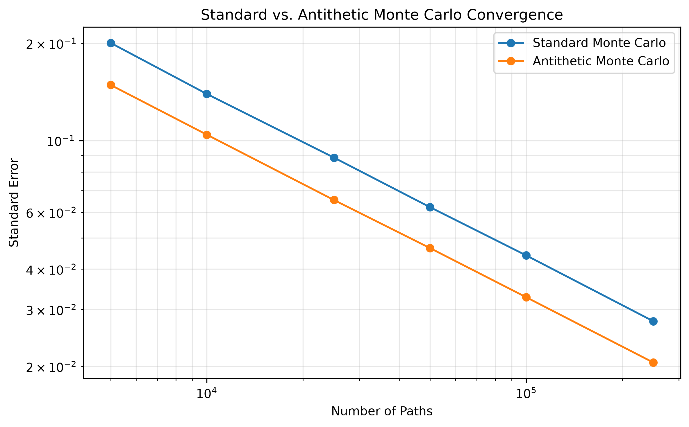
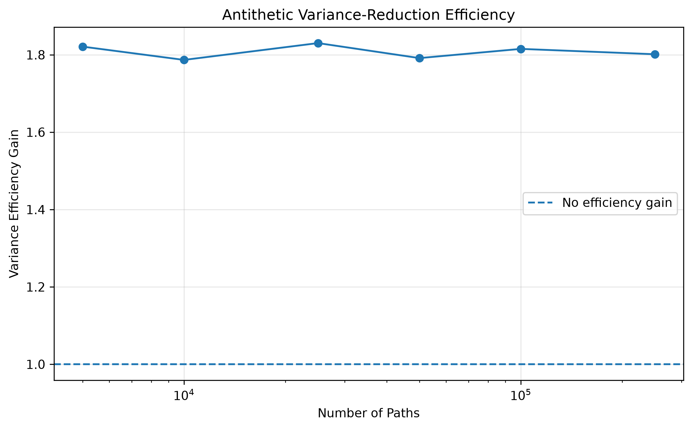

# Antithetic Variates for Monte Carlo Pricing

## Objective

Compare standard Monte Carlo with antithetic Monte Carlo under the same total path budget and quantify the variance reduction.

## Method

For each standard normal draw $Z$, antithetic sampling also uses $-Z$.

For each antithetic pair, let $Y_i^{(+)}$ and $Y_i^{(-)}$ denote the undiscounted payoff observations. Their pair average is

$$
A_i = \frac{Y_i^{(+)} + Y_i^{(-)}}{2}.
$$

If there are $M$ independent antithetic pairs, the price estimator is

$$
\hat V_{\mathrm{AV}}
=
e^{-rT}\frac{1}{M}\sum_{i=1}^{M}A_i,
$$

with estimated standard error

$$
\mathrm{SE}_{\mathrm{AV}}
=
e^{-rT}\frac{s_A}{\sqrt{M}},
$$

where $s_A$ is the sample standard deviation of the pair averages.

The reported path count is the total number of simulated paths, so $N=2M$.

## Experimental Setup

| Parameter | Value |
| :--- | ---: |
| Initial price $S_0$ | 100 |
| Strike $K$ | 100 |
| Volatility $\sigma$ | 0.20 |
| Risk-free rate $r$ | 0.05 |
| Dividend yield $q$ | 0.02 |
| Maturity $T$ | 1.0 |
| Time steps | 252 |
| Random seed | 42 |

Path counts ranged from 5,000 to 250,000. Standard and antithetic Monte Carlo used the same total number of simulated paths at each budget.

## Results

| Paths | Standard SE | Antithetic SE | Efficiency Gain |
| ---: | ---: | ---: | ---: |
| 5,000 | 0.200544 | 0.148608 | 1.8211 |
| 10,000 | 0.139384 | 0.104276 | 1.7867 |
| 25,000 | 0.088549 | 0.065454 | 1.8302 |
| 50,000 | 0.062168 | 0.046447 | 1.7914 |
| 100,000 | 0.044089 | 0.032724 | 1.8152 |
| 250,000 | 0.027577 | 0.020547 | 1.8014 |

The efficiency metric is

$$
G =
\frac{SE_{\text{standard}}^2}
     {SE_{\text{antithetic}}^2}.
$$

Across the tested path budgets, the antithetic estimator achieved an efficiency gain of approximately $1.8$ times.

The fitted convergence slopes were

$$
\text{Standard MC}: -0.5054,
$$

$$
\text{Antithetic MC}: -0.5049,
$$

compared with the theoretical Monte Carlo rate of $-0.5$.

Both estimators retain the expected $N^{-1/2}$ convergence rate, while the antithetic estimator has a consistently lower standard error.

The variance-efficiency gain remains close to 1.8 across the tested path counts.

## Conclusion

Antithetic variates substantially reduce the sampling variance of the European-call Monte Carlo estimator without changing its asymptotic $N^{-1/2}$ convergence rate.

The experiment therefore shows that variance reduction improves the constant in the Monte Carlo error rate rather than its convergence order. Under the tested configuration, antithetic sampling delivers approximately 1.8 times the statistical efficiency of standard Monte Carlo under the same path budget.