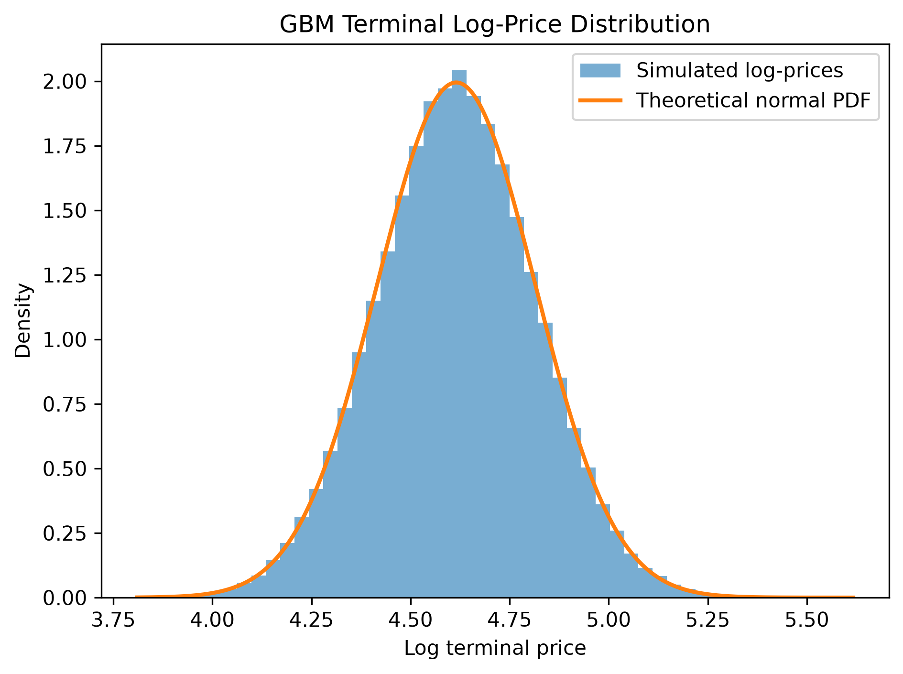
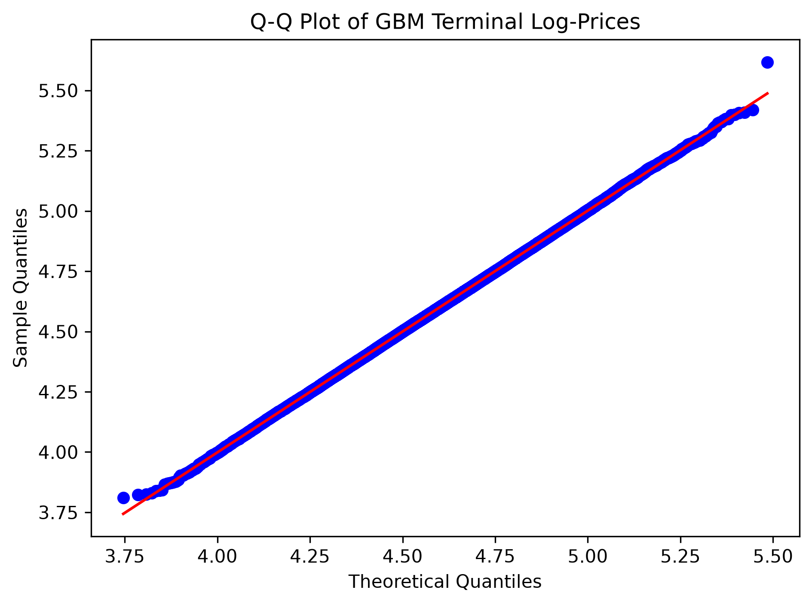

# GBM Simulation Validation

## Objective
This experiment validates the Geometric Brownian Motion (GBM) simulator against the theoretical statistical properties of risk-neutral GBM.
The validation has two layers:

- Moment validation of the terminal price ($S_T$);
- Distributional validation of the terminal log-price ($\ln(S_T)$).

The goal is to establish confidence that the simulation engine reproduces the theoretical terminal-price properties implied by GBM.

## Theoretical Framework
Under the risk-neutral measure,
$$ dS_t = (r-q)S_t dt + \sigma S_t dW_t^Q. $$

The simulator uses the exact GBM transition:
$$ S_{t+\Delta t} = S_t \exp\left[ \left(r-q-\frac12 \sigma^2 \right) \Delta t + \sigma\sqrt{\Delta t}Z \right], \qquad Z\sim \mathcal{N}(0,1). $$

Therefore,
$$ E[S_T] = S_0 e^{(r-q)T}, $$
and
$$ \operatorname{Var}(S_T) = S_0^2 e^{2(r-q)T} \left(e^{\sigma^2 T}-1\right). $$

Taking logarithms,
$$ \ln(S_T) \sim N(\mu_{\log}, \sigma_{\log}^2), $$
where
$$ \mu_{\log} = \ln(S_0) + \left(r-q-\frac12\sigma^2\right)T, $$
$$ \sigma_{\log} = \sigma\sqrt{T}. $$

## Experimental Setup

| Parameter | Value |
| :--- | :--- |
| Initial price ($S_0$) | 100 |
| Volatility ($\sigma$) | 0.20 |
| Risk-free rate ($r$) | 0.05 |
| Dividend yield ($q$) | 0.02 |
| Maturity ($T$) | 1.0 |
| Time steps | 252 |
| Number of paths | 100,000 |
| Random seed | 42 |

## Results

### Moment Validation

| Quantity | Simulated | Theoretical |
| :--- | :--- | :--- |
| Mean | 103.087808 | 103.045453 |
| Variance | 437.282125 | 433.343715 |

The simulated mean differs from the theoretical value by 0.042355, corresponding to 0.64 standard errors. The sample variance differs from the theoretical variance by approximately 0.91%.
These results are consistent with the theoretical GBM moments.

### Distributional Validation
For the baseline parameters,
$$ \ln(S_T) \sim \mathcal{N}(4.615170, 0.2^2). $$

The Kolmogorov-Smirnov test gives:

| Statistic | Value |
| :--- | :--- |
| KS statistic ($D$) | 0.002252 |
| KS p-value | 0.690025 |

The empirical distribution closely matches the theoretical normal distribution.

- The histogram shows close agreement between the simulated log-price density and the theoretical normal PDF.

- The Q-Q plot shows near-linear agreement across the distribution, with only minor deviations at the most extreme observations.

The KS statistic of 0.002252 corresponds to a maximum empirical-versus-theoretical CDF difference of approximately 0.23%. The p-value provides no evidence against the theoretical normal distribution. Because the sample contains 100,000 observations, the KS test is interpreted together with the magnitude of $D$ and the visual diagnostics rather than as a standalone pass/fail criterion.

## Conclusion
The GBM simulator reproduces the theoretical terminal-price moments and the predicted normal distribution of terminal log-prices with close agreement. Together, the moment analysis, KS test, histogram, and Q-Q plot provide strong evidence that the simulation engine reproduces the expected terminal-price statistical behavior.