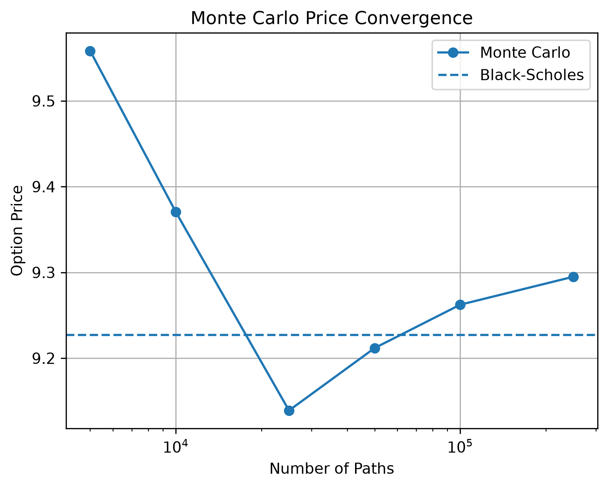
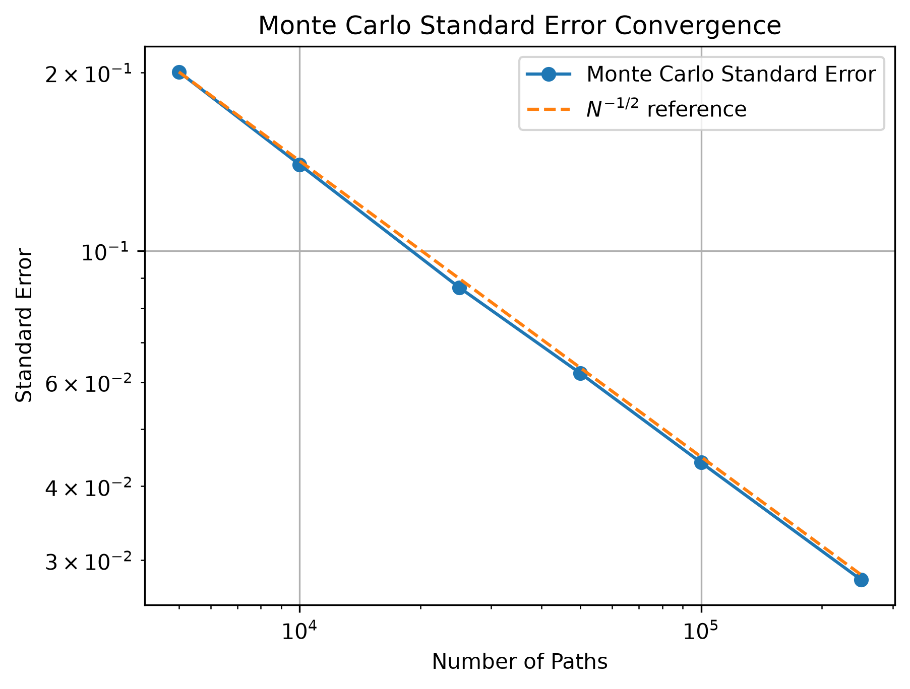
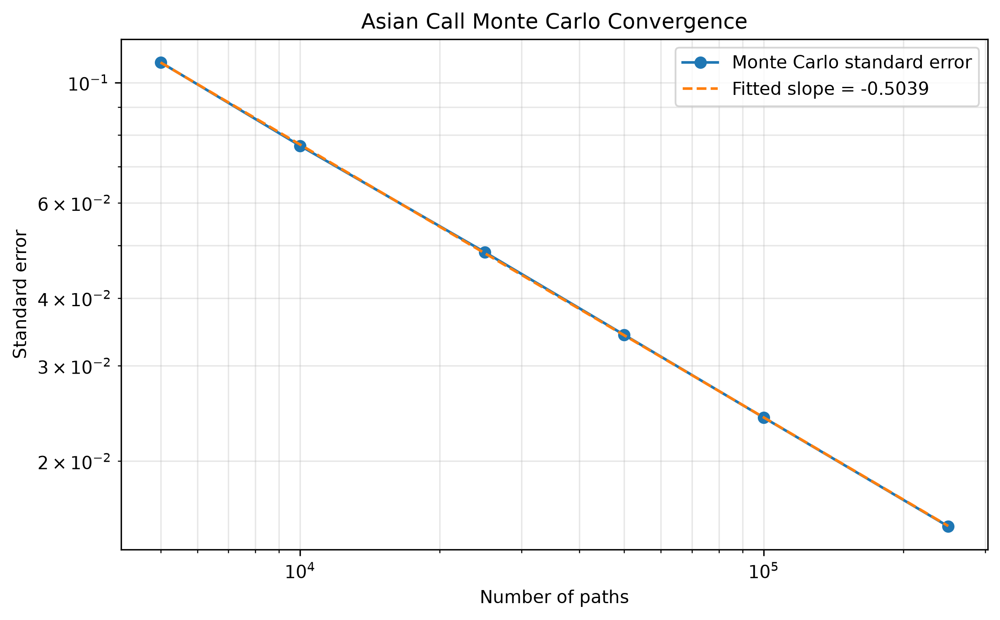

# Monte Carlo Validation

## 1. Objective

This experiment validates the Monte Carlo pricing engine under a risk-neutral Geometric Brownian Motion (GBM) framework for both terminal-value and path-dependent payoffs.

The validation has three objectives:

1. Validate the European call Monte Carlo estimator against the analytical Black-Scholes benchmark.
2. Verify the expected Monte Carlo convergence rate, $\mathrm{SE}\propto N^{-1/2}$.
3. Demonstrate that the same generic engine supports a path-dependent arithmetic-average Asian call using full simulated paths.

## 2. Risk-Neutral Pricing Framework

Under the risk-neutral measure $\mathbb{Q}$, the value of a European option is

$$
V_0=e^{-rT}\mathbb{E}^{\mathbb{Q}}[\Pi(S_T)].
$$

The underlying follows the risk-neutral GBM

$$
dS_t=(r-q)S_t\,dt+\sigma S_t\,dW_t^{\mathbb{Q}},
$$

with exact terminal solution

$$
S_T=S_0\exp\left[\left(r-q-\frac12\sigma^2\right)T+\sigma\sqrt{T}Z\right],
\qquad Z\sim\mathcal{N}(0,1).
$$

The simulation therefore uses the risk-neutral drift $r-q$. The same framework applies to path-dependent derivatives, except that the payoff is a functional of the simulated path rather than only $S_T$.

## 3. European Call Validation

### 3.1 Setup

The analytical and Monte Carlo models use the same parameters:

| Parameter | Symbol | Value |
| :--- | :--- | :--- |
| Spot Price | $S_0$ | 100 |
| Strike Price | $K$ | 100 |
| Volatility | $\sigma$ | 20% |
| Risk-free Rate | $r$ | 5% |
| Dividend Yield | $q$ | 2% |
| Maturity | $T$ | 1 year |

For 100,000 paths, 252 time steps, and seed 42, the European call payoff is

$$
\Pi(S_T)=\max(S_T-K,0),
$$

and the Monte Carlo estimator is

$$
\hat V_{\mathrm{MC}}
=e^{-rT}\frac1N\sum_{i=1}^N\Pi(S_T^{(i)}).
$$

Its standard error is

$$
\mathrm{SE}(\hat V_{\mathrm{MC}})
=e^{-rT}\frac{s_\Pi}{\sqrt N},
$$

where $s_\Pi$ is the sample standard deviation of the undiscounted payoff observations.

For statistical validation, the standardized error is

$$
Z=\frac{\hat V_{\mathrm{MC}}-V_{\mathrm{BS}}}
{\mathrm{SE}(\hat V_{\mathrm{MC}})},
$$

and the 95% confidence interval is

$$
\hat V_{\mathrm{MC}}\pm1.96\,\mathrm{SE}(\hat V_{\mathrm{MC}}).
$$

### 3.2 Results

The Black-Scholes benchmark is

$$
V_{\mathrm{BS}}=9.227006.
$$

The Monte Carlo results are:

| Metric | Result |
| :--- | :--- |
| Black-Scholes price | 9.227006 |
| Monte Carlo price | 9.258790 |
| Standard error | 0.044089 |
| Absolute difference | 0.031785 |
| Standardized error ($Z$) | 0.7209 |
| 95% confidence interval | [9.172376, 9.345204] |
| BS price inside CI | Yes |

The Monte Carlo estimate is therefore statistically consistent with the Black-Scholes benchmark at the 95% confidence level for this parameter configuration.

### 3.3 Convergence Analysis

The European experiment was repeated for

$$
N\in\{5{,}000,10{,}000,25{,}000,50{,}000,100{,}000,250{,}000\}.
$$

| Paths ($N$) | MC Price | Absolute Error | Standard Error | $\mathrm{SE}\sqrt N$ |
| :--- | ---: | ---: | ---: | ---: |
| 5,000 | 9.558189 | 0.331183 | 0.200544 | 14.180570 |
| 10,000 | 9.370442 | 0.143436 | 0.139766 | 13.976604 |
| 25,000 | 9.138996 | 0.088009 | 0.086631 | 13.697536 |
| 50,000 | 9.211793 | 0.015213 | 0.062093 | 13.884433 |
| 100,000 | 9.262359 | 0.035353 | 0.043857 | 13.868764 |
| 250,000 | 9.294959 | 0.067954 | 0.027819 | 13.909313 |

The quantity $\mathrm{SE}\sqrt N$ remains approximately constant (13.7–14.2), and a log-log regression gives an empirical slope of **-0.5040**, close to the theoretical **-0.5**. This is consistent with the expected $\mathcal{O}(N^{-1/2})$ convergence rate.

### 3.4 Convergence Visualization

The standard-error plot includes the theoretical $-1/2$ reference slope.

## 4. Path-Dependent Asian Call Validation

Unlike the European call, the arithmetic-average Asian call depends on the full simulated path.

### 4.1 Pricing Architecture

The same infrastructure is reused:

$$
\mathrm{GBM}
\rightarrow
\mathrm{Simulator}
\rightarrow
\mathrm{SimulationResult}
\rightarrow
\mathrm{MonteCarloPricer}
\rightarrow
\mathrm{AsianCall}.
$$

The payoff declares its information requirement. Terminal-value payoffs receive the terminal values, while path-dependent payoffs receive the full paths. This keeps the Monte Carlo pricer generic and avoids derivative-specific pricing branches.

### 4.2 Payoff

For path $j$, the arithmetic average over the 252 post-initial monitoring observations is

$$
\bar S^{(j)}
=
\frac1{252}\sum_{i=1}^{252}S_{t_i}^{(j)}.
$$

The Asian call payoff is

$$
\Pi^{(j)}=\max(\bar S^{(j)}-K,0),
$$

with price estimator

$$
\hat V_{\mathrm{Asian}}
=
e^{-rT}\frac1N\sum_{j=1}^N\Pi^{(j)}.
$$

### 4.3 Results

| Parameter | Value |
| :--- | ---: |
| Spot Price | 100 |
| Strike Price | 100 |
| Volatility | 20% |
| Risk-free Rate | 5% |
| Dividend Yield | 2% |
| Maturity | 1 year |
| Time Steps | 252 |
| Random Seed | 42 |
| Number of Paths | 100,000 |

The 100,000-path experiment produced:

| Metric | Result |
| :--- | ---: |
| Monte Carlo price | 5.198045 |
| Standard error | 0.024054 |
| 95% confidence interval | [5.150900, 5.245190] |

No analytical benchmark for this discretely monitored Asian call is implemented in the project, so validation is based on Monte Carlo convergence rather than comparison with a closed-form value.

### 4.4 Convergence Analysis

| Paths ($N$) | MC Price | Standard Error | $\mathrm{SE}\sqrt N$ |
| :--- | ---: | ---: | ---: |
| 5,000 | 5.254084 | 0.108992 | 7.706930 |
| 10,000 | 5.238531 | 0.076423 | 7.642266 |
| 25,000 | 5.310290 | 0.048629 | 7.688884 |
| 50,000 | 5.248785 | 0.034200 | 7.647321 |
| 100,000 | 5.198045 | 0.024054 | 7.606402 |
| 250,000 | 5.191129 | 0.015145 | 7.572728 |

The standard error decreases with $N$, while $\mathrm{SE}\sqrt N$ remains approximately stable at 7.57–7.71. A log-log regression gives

$$
\log(\mathrm{SE})=\alpha\log(N)+C,
\qquad
\alpha=-0.5039,
$$

versus the theoretical $\alpha=-0.5$. This provides empirical evidence of the expected $\mathcal{O}(N^{-1/2})$ convergence rate.

## 5. Interpretation

### Non-Monotonic Price Convergence

Monte Carlo price estimates need not move monotonically toward a benchmark. Increasing $N$ reduces estimator variance and standard error, but a higher-path realization can still have a larger realized error than a lower-path run.

### Path Dependence and Asian Call Value

The Asian call estimate is approximately 5.19, compared with approximately 9.23 for the European call under the same market parameters. The lower Asian value is qualitatively consistent with arithmetic averaging reducing the variability of the quantity entering the call payoff.

More importantly, the experiment demonstrates that the same GBM simulation and generic pricing engine can support both terminal-value and path-dependent derivatives. The payoff determines whether terminal or path-level information is required.

## 6. Conclusion

The Monte Carlo engine was validated in two settings. The European call agreed statistically with the Black-Scholes benchmark, and its empirical convergence slope was **-0.5040**. The path-dependent Asian call exhibited the same theoretical convergence behavior, with an empirical slope of **-0.5039** and stable $\mathrm{SE}\sqrt N$.

The results support the separation of stochastic simulation, payoff definitions, and pricing logic: the same generic Monte Carlo engine can handle both terminal-value and path-dependent payoffs without embedding derivative-specific logic in the pricing layer.
